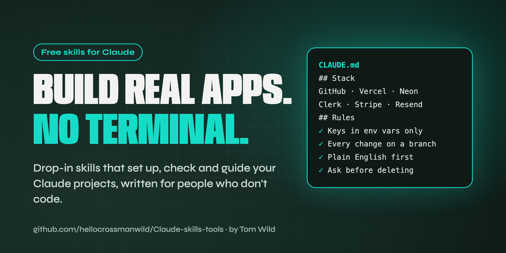
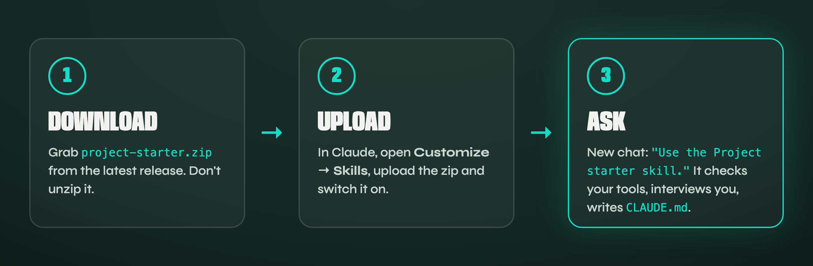

<p align="center">
  
</p>

<p align="center">
  <a href="https://github.com/hellocrossmanwild/Claude-skills-tools/releases/latest"></a>
  
  
  
  <a href="LICENSE"></a>
</p>

<p align="center">
  <b>Free, drop-in skills that set up, check and guide your Claude projects.</b><br>
  Written for founders, designers and anyone building real apps without a development background.
</p>

<p align="center">
  <a href="#-skills">Skills</a> ·
  <a href="#-install-in-60-seconds">Install</a> ·
  <a href="#-project-starter">Project starter</a> ·
  <a href="#-faq">FAQ</a> ·
  <a href="#-request-a-skill">Request a skill</a>
</p>

---

## What's a skill?

A **skill** is a small set of instructions Claude follows whenever it needs them. Install one once, and Claude knows exactly how to do that job your way, every time, without you re-explaining it.

Every skill here is:

- **No terminal.** Install it by uploading a file in Claude. Use it by asking in plain English.
- **Safe by default.** Skills check before they change anything, and never ask you to paste secret keys into a chat.
- **Plain English.** Claude explains what it's doing as it goes.

## 🧰 Skills

| Skill | What it does | Download |
|---|---|---|
| **[Project starter](skills/project-starter/SKILL.md)** | Checks every tool you've connected to Claude actually works, interviews you about your app idea, then writes `CLAUDE.md`: your project's rules file. | [**project-starter.zip**](https://github.com/hellocrossmanwild/Claude-skills-tools/releases/latest/download/project-starter.zip) |

More skills are on the way. [Watch the repo](https://github.com/hellocrossmanwild/Claude-skills-tools/subscription) to hear when they land.

## ⚡ Install in 60 seconds

<p align="center"></p>

1. **Download** the skill's `.zip` from the table above. Don't unzip it.
2. In **Claude Desktop** or **claude.ai**, open **Customize → Skills**, upload the zip, and make sure it's switched on.
3. Start a **new chat** and ask for it by name, for example: *"Use the Project starter skill."*

> Skills need **code execution** switched on (Settings → Capabilities). Connectors such as GitHub and Vercel are added in Claude under **Customize → Connectors**.

## 🚀 Project starter

The first thing to run on any new project.

**1. Checks every connected tool.** It lists every connector Claude can see, runs one small **read-only** check on each to prove the sign-in works, and tells you how to fix anything that fails.

| Tool | Status | What Claude saw |
|---|---|---|
| GitHub | ✓ | 1 repo: my-project |
| Vercel | ✓ | No projects yet |
| Neon | ✓ | No projects yet |
| Stripe | ✓ | Account reached (sandbox) |
| Resend | ✗ | Sign-in expired. Go to Connectors and reconnect Resend |

**2. Interviews you about your idea.** One question at a time, with tap-to-answer options where it can. It stops when it could explain your app to a stranger in two sentences, and checks it's got it right.

**3. Writes `CLAUDE.md`, your project's rules.** Claude reads this file at the start of every session, so you never have to repeat yourself.

```markdown
# Slot Book

## What this is
A booking app for independent hairdressers. Clients pick a free slot and pay a deposit; it makes money from a monthly subscription.

## Stack
- Next.js app, code in GitHub, hosted on Vercel
- Database: Neon (Postgres) · Logins: Clerk · Payments: Stripe · Email: Resend
Don't add other services without asking me first and explaining why.

## Rules
- Secret keys only ever go in environment variables. Never in code, the chat, or a commit.
- Every change happens on a branch, with a pull request I can read before it goes into main.
- Explain what you're about to do in plain English before you do it.
- Ask me before deleting files or data, or touching anything outside this project folder.
```

📺 **Watch it in action:** the full setup, from Claude Desktop to a connected stack with no terminal, is on [my YouTube channel](https://www.youtube.com/@tom-ac-wild).

## ❓ FAQ

<details>
<summary><b>Do I need to know how to code?</b></summary>
<br>No. These skills are written for people who don't. Everything is installed and used inside the Claude app.
</details>

<details>
<summary><b>Which Claude plan do I need?</b></summary>
<br>Skills work on Claude's paid and free plans with code execution switched on. Building in the <b>Code</b> tab of Claude Desktop needs a paid plan (Pro, Max, Team or Enterprise).
</details>

<details>
<summary><b>Is it safe? Will it change my accounts?</b></summary>
<br>The connection check only reads (lists repos, projects and account info). Nothing is created, changed or deleted. The skill never asks for your keys or passwords, and writes rules that tell Claude to keep secrets out of your code.
</details>

<details>
<summary><b>I already have a CLAUDE.md. Will it overwrite it?</b></summary>
<br>No. It shows you what's there and asks whether to add to it or start fresh.
</details>

<details>
<summary><b>Does it work with Claude Code in the terminal?</b></summary>
<br>Yes. Put the <code>project-starter</code> folder in <code>~/.claude/skills/</code> (all projects) or <code>.claude/skills/</code> in your project.
</details>

## 💡 Request a skill

Got a job you keep explaining to Claude? [Request a skill](https://github.com/hellocrossmanwild/Claude-skills-tools/issues/new?template=skill-request.yml) and tell me what it should do.

## 👋 About

Made by **[Tom Wild](https://hellocrossman.com)**, a product designer for nearly 20 years who now builds real products with Claude every day. I turn service businesses into software they own.

[Website](https://hellocrossman.com) · [YouTube](https://www.youtube.com/@tom-ac-wild) · [LinkedIn](https://www.linkedin.com/in/tom-wild)

<sub>MIT licence. Use them, change them, share them. Not affiliated with Anthropic; Claude is a trademark of Anthropic.</sub>
